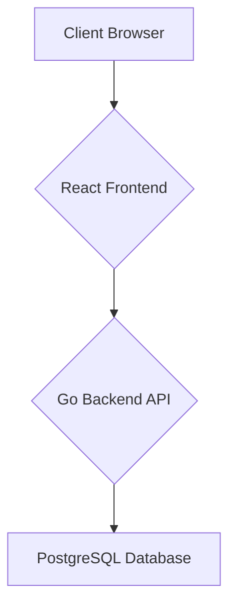

# Shopping Application Documentation

This document provides a comprehensive overview of the shopping application's architecture, database schema, API endpoints, and overall workflow.

## 1. Application Architecture

The application is built with a modern, decoupled architecture, consisting of three main components:

*   **Frontend:** A responsive single-page application (SPA) built with **React**. It handles the user interface and all client-side interactions.
*   **Backend:** A robust RESTful API built with **Go (Golang)**. It manages business logic, data processing, and communication with the database.
*   **Database:** A **PostgreSQL** database used to store and manage all application data, including users, products, and admins.

### Architectural Diagram

The following diagram illustrates the high-level architecture of the application:

## 2. Database Schema

The database consists of three tables: `admins`, `users`, and `products`.

### `admins` Table

Stores administrator credentials.

| Column   | Type          | Constraints      | Description                  |
| :------- | :------------ | :--------------- | :--------------------------- |
| `id`     | `SERIAL`      | `PRIMARY KEY`    | Unique identifier for admins |
| `username` | `VARCHAR(50)` | `UNIQUE NOT NULL`| Admin's username             |
| `password` | `TEXT`        | `NOT NULL`       | Admin's hashed password      |

### `users` Table

Stores user information and credentials.

| Column   | Type           | Constraints      | Description                |
| :------- | :------------- | :--------------- | :------------------------- |
| `id`     | `SERIAL`       | `PRIMARY KEY`    | Unique identifier for users|
| `username` | `VARCHAR(50)`  | `UNIQUE NOT NULL`| User's username            |
| `password` | `TEXT`         | `NOT NULL`       | User's hashed password     |
| `email`    | `VARCHAR(100)` | `UNIQUE NOT NULL`| User's email address       |

### `products` Table

Stores information about the products available in the store.

| Column        | Type                  | Constraints   | Description                            |
| :------------ | :-------------------- | :------------ | :------------------------------------- |
| `id`          | `SERIAL`              | `PRIMARY KEY` | Unique identifier for products         |
| `name`        | `VARCHAR(255)`        | `NOT NULL`    | Name of the product                    |
| `description` | `TEXT`                |               | Detailed description of the product    |
| `price`       | `NUMERIC(10, 2)`      | `NOT NULL`    | Price of the product                   |
| `created_at`  | `TIMESTAMP WITH TIME ZONE` | `DEFAULT CURRENT_TIMESTAMP` | Timestamp of product creation |

## 3. API Endpoints

The backend exposes the following RESTful API endpoints.

### Admin Routes

| Method   | Path                          | Description                  |
| :------- | :---------------------------- | :--------------------------- |
| `POST`   | `/api/admin/signup`           | Register a new admin.        |
| `POST`   | `/api/admin/login`            | Log in an admin.             |
| `GET`    | `/api/admin/products`         | Get all products.            |
| `POST`   | `/api/admin/products`         | Create a new product.        |
| `GET`    | `/api/admin/products/{id}`    | Get a single product by ID.  |
| `PUT`    | `/api/admin/products/{id}`    | Update a product by ID.      |
| `DELETE` | `/api/admin/products/{id}`    | Delete a product by ID.      |
| `GET`    | `/api/admin/users`            | Get all users.               |
| `PUT`    | `/api/admin/users/{id}`       | Update a user by ID.         |
| `DELETE` | `/api/admin/users/{id}`       | Delete a user by ID.         |

### User Routes

| Method | Path                | Description           |
| :----- | :------------------ | :-------------------- |
| `POST` | `/api/user/signup`  | Register a new user.  |
| `POST` | `/api/user/login`   | Log in a user.        |
| `GET`  | `/api/products`     | Get all products.     |

## 4. Workflow Example: User Views Products

Here is a step-by-step workflow of a user viewing the products on the website:

1.  **Browser Request:** The user navigates to the "Products" page in their browser.
2.  **Frontend (React):**
    *   The `ProductsPage` component mounts.
    *   A `useEffect` hook triggers a `fetch` request to the backend API endpoint `GET /api/products`.
3.  **Backend (Go):**
    *   The Go server receives the `GET` request at `/api/products`.
    *   The `GetAllProducts` handler function is executed.
    *   The handler queries the **PostgreSQL** database to retrieve all records from the `products` table.
    *   The database returns the list of products to the handler.
    *   The handler serializes the product list into a JSON array.
    *   The backend sends the JSON array back to the frontend with a `200 OK` status code.
4.  **Frontend (React):**
    *   The `fetch` request resolves with the JSON data.
    *   The `products` state in the `ProductsPage` component is updated with the fetched data.
    *   React re-renders the component, mapping over the `products` array to display each product in a card on the UI.
5.  **Browser Display:** The user sees the list of products rendered on the page.

This workflow demonstrates the decoupled nature of the application, where the frontend and backend communicate through a well-defined API, allowing for independent development and scaling.

#  my notes

* Routes:
    frontend router-> App.js
    backend router-> main.go